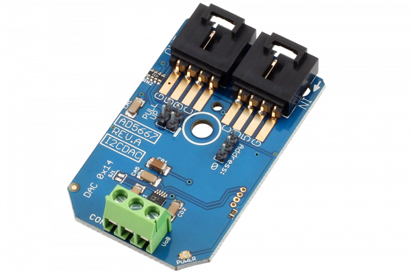

[](https://store.ncd.io/product/ad5667-16-bit-2-channel-digital-to-analog-converter-i2c-mini-module/).

# AD5667

The AD5667 is a general purpose I2C high-resolution digital to analog converter (DAC) capable of generating a 0-5V voltage output.

With 16-Bit resolution, the AD5667 is capable of finely tuning the voltage output across 65,536 steps, with an individual step voltage of 0.0000763 volts DC.
This Device is available from www.ncd.io

[SKU: AD5667]

(https://store.ncd.io/product/ad5667-16-bit-2-channel-digital-to-analog-converter-i2c-mini-module/)
This Sample code can be used with Raspberry Pi.

Hardware needed to interface AD5667 2-Channel DAC With Raspberry Pi :

1. <a href="https://store.ncd.io/product/ad5667-16-bit-2-channel-digital-to-analog-converter-i2c-mini-module/">AD5667 16-Bit 2-Channel DAC I2C Mini Module</a>

2.  <a href="https://store.ncd.io/product/i2c-shield-for-raspberry-pi-3-pi2-with-outward-facing-i2c-port-terminates-over-hdmi-port/">Raspberry Pi I2C Shield</a>

3. <a href="https://store.ncd.io/product/i%C2%B2c-cable/">I2C Cable</a>

## Python

Download and install smbus library on Raspberry pi. Steps to install smbus are provided at:

https://pypi.python.org/pypi/smbus-cffi/0.5.1

Download (or git pull) the code in pi. Run the program.

```cpp
$> python AD5667.py
```
The lib is a sample library, you will need to calibrate the sensor according to your application requirement.
